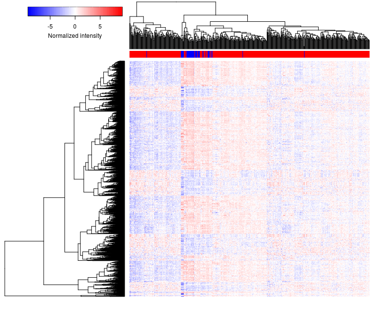
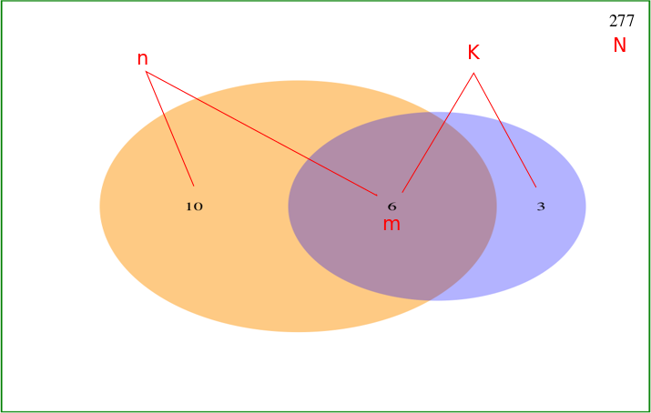
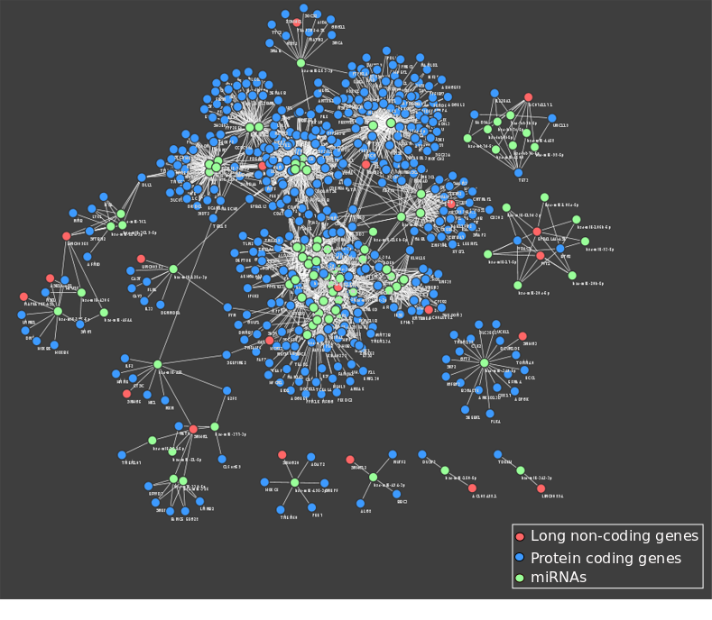
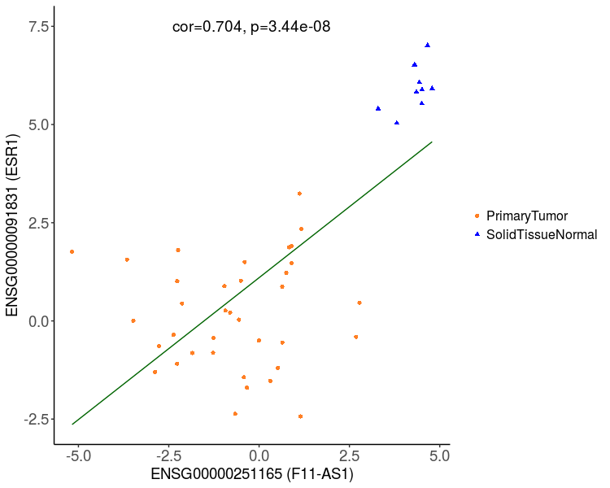
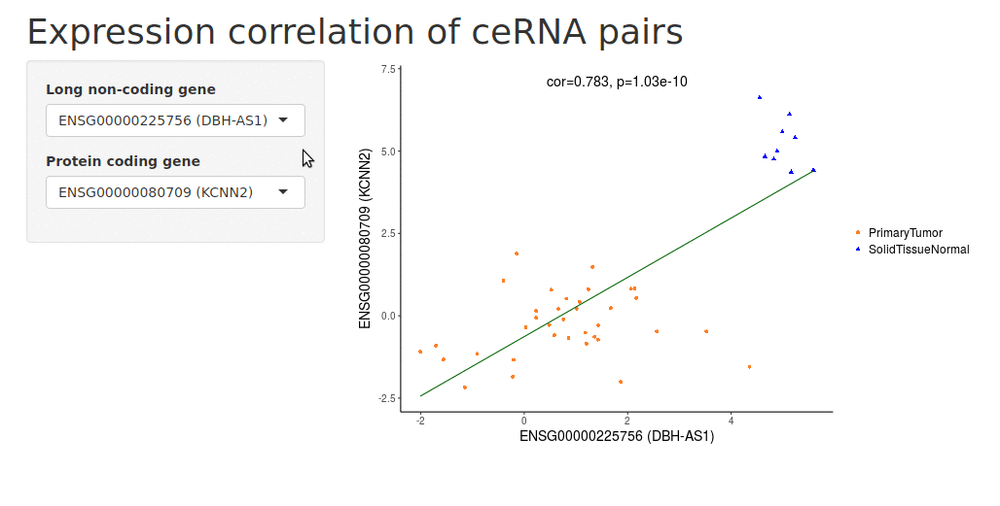
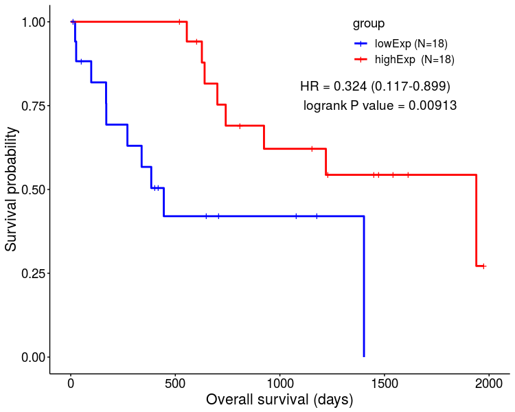
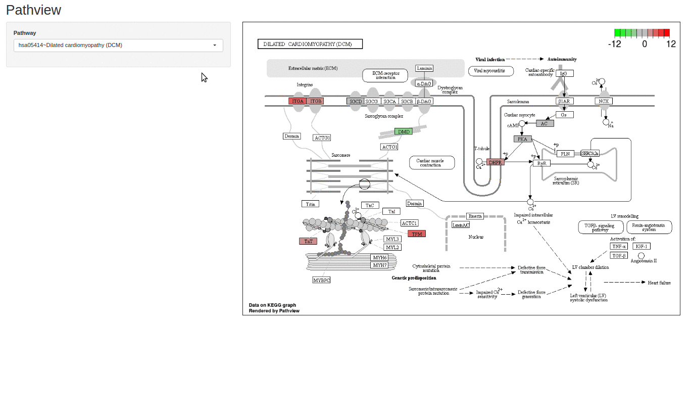

# Introduction

`GDCRNATools` is an R package which provides a standard, easy-to-use and comprehensive pipeline for downloading, organizing, and integrative analyzing RNA expression data in the GDC portal with an emphasis on deciphering the lncRNA-mRNA related ceRNAs regulatory network in cancer.

Competing endogenous RNAs (ceRNAs) are RNAs that indirectly regulate other transcripts by competing for shared miRNAs. Although only a fraction of long non-coding RNAs has been functionally characterized, increasing evidences show that lncRNAs harboring multiple miRNA response elements (MREs) can act as ceRNAs to sequester miRNA activity and thus reduce the inhibition of miRNA on its targets. Deregulation of ceRNAs network may lead to human diseases.

The [Genomic Data Commons (GDC)](https://portal.gdc.cancer.gov/) maintains standardized genomic, clinical, and biospecimen data from National Cancer Institute (NCI) programs including [The Cancer Genome Atlas (TCGA)](https://tcga-data.nci.nih.gov/) and [Therapeutically Applicable Research To Generate Effective Treatments (TARGET)](https://ocg.cancer.gov/programs/target), It also accepts high quality datasets from non-NCI supported cancer research programs, such as genomic data from the [Foundation Medicine](https://www.foundationmedicine.com/).

Many analyses can be perfomed using GDCRNATools, including differential gene expression analysis ([limma](http://bioconductor.org/packages/release/bioc/html/limma.html)[@Ritchielimmapowersdifferential2015a], [edgeR](http://bioconductor.org/packages/release/bioc/html/edgeR.html)[@RobinsonedgeRBioconductorpackage2010], and [DESeq2](http://bioconductor.org/packages/release/bioc/html/DESeq2.html)[@LoveModeratedestimationfold2014]), univariate survival analysis (CoxPH and KM), competing endogenous RNA network analysis (hypergeometric test, Pearson correlation analysis, regulation similarity analysis, sensitivity Pearson partial  correlation[@PaciComputationalanalysisidentifies2014]), and functional enrichment analysis(GO, KEGG, DO). Besides some routine visualization methods such as volcano plot, scatter plot, and bubble plot, etc., three simple shiny apps are developed in GDCRNATools allowing users visualize the results on a local webpage. All the figures are plotted based on [ggplot2](https://cran.r-project.org/web/packages/ggplot2/index.html) package unless otherwise specified.

This user-friendly package allows researchers perform the analysis by simply running a few functions and integrate their own pipelines such as molecular subtype classification, [weighted correlation network analysis (WGCNA)](https://labs.genetics.ucla.edu/horvath/CoexpressionNetwork/Rpackages/WGCNA/)[@LangfelderWGCNApackageweighted2008], and TF-miRNA co-regulatory network analysis, etc. into the workflow easily. This could open a door to accelerate the study of crosstalk among different classes of RNAs and their regulatory relationships in cancer.

***

# Citation
If you use `GDCRNATools` in your published research, please cite:

Li, R., Qu, H., Wang, S., Wei, J., Zhang, L., Ma, R., Lu, J., Zhu, J., Zhong, W., and Jia, Z. (2018). GDCRNATools: an R/Bioconductor package for integrative analysis of lncRNA, miRNA and mRNA data in GDC. Bioinformatics 34, 2515-2517. https://doi.org/10.1093/bioinformatics/bty124.

***

# `GDCRNATools` package installation 

The stable release version can be installed by running:
```{r stable version, eval=FALSE, message=FALSE, warning=FALSE}
## try http:// if https:// URLs are not supported
if (!requireNamespace("BiocManager", quietly=TRUE))
    install.packages("BiocManager")
BiocManager::install("GDCRNATools")
```

To install the development version, please update your R and Biocondutor to the latest version and run:
```{r development version, eval=FALSE, message=FALSE, warning=FALSE}
if (!requireNamespace("BiocManager", quietly=TRUE))
    install.packages("BiocManager")
BiocManager::install("GDCRNATools", version = "devel")
```


```{r load, eval=TRUE, message=FALSE, warning=FALSE}
library(GDCRNATools)
```

***

# Quick start
In `GDCRNATools`, some functions are built for users to download and process GDC data efficiently.
Users can also use their own data that is processed by other tools such as the [UCSC Xena GDC hub](https://xenabrowser.net/datapages/?host=https://gdc.xenahubs.net), [TCGAbiolinks](https://bioconductor.org/packages/release/bioc/html/TCGAbiolinks.html)[@ColapricoTCGAbiolinksBioconductorpackage2016], or [TCGA-Assembler](http://www.compgenome.org/TCGA-Assembler/)[@ZhuTCGAAssemblerOpenSourcePipeline2014], etc.

Here we use a small dataset to show the most basic steps for ceRNAs network analysis. More detailed instruction of each step is in the [Case Study](#case) section.

## Data preparation
### Normalization of HTSeq-Counts data
```{r load data q, message=FALSE, warning=FALSE, eval=TRUE}
library(DT)

### load RNA counts data
data(rnaCounts)

### load miRNAs counts data
data(mirCounts)
```

```{r normalization q, message=FALSE, warning=FALSE, eval=TRUE}
####### Normalization of RNAseq data #######
rnaExpr <- gdcVoomNormalization(counts = rnaCounts, filter = FALSE)

####### Normalization of miRNAs data #######
mirExpr <- gdcVoomNormalization(counts = mirCounts, filter = FALSE)
```


### Parse metadata
```{r parse meta2 q, message=FALSE, warning=FALSE, eval=TRUE}
####### Parse and filter RNAseq metadata #######
metaMatrix.RNA <- gdcParseMetadata(project.id = 'TCGA-CHOL',
                                   data.type  = 'RNAseq', 
                                   write.meta = FALSE)

metaMatrix.RNA <- gdcFilterDuplicate(metaMatrix.RNA)
metaMatrix.RNA <- gdcFilterSampleType(metaMatrix.RNA)
datatable(as.data.frame(metaMatrix.RNA[1:5,]), extensions = 'Scroller',
        options = list(scrollX = TRUE, deferRender = TRUE, scroller = TRUE))

```


## ceRNAs network analysis
### Identification of differentially expressed genes (DEGs)
```{r deg q, message=FALSE, warning=FALSE, eval=TRUE}
DEGAll <- gdcDEAnalysis(counts     = rnaCounts, 
                        group      = metaMatrix.RNA$sample_type, 
                        comparison = 'PrimaryTumor-SolidTissueNormal', 
                        method     = 'limma')
datatable(as.data.frame(DEGAll), 
        options = list(scrollX = TRUE, pageLength = 5))

### All DEGs
deALL <- gdcDEReport(deg = DEGAll, gene.type = 'all')

### DE long-noncoding
deLNC <- gdcDEReport(deg = DEGAll, gene.type = 'long_non_coding')

### DE protein coding genes
dePC <- gdcDEReport(deg = DEGAll, gene.type = 'protein_coding')
```


### ceRNAs network analysis of DEGs
```{r ce q, message=TRUE, warning=FALSE, eval=TRUE}
ceOutput <- gdcCEAnalysis(lnc         = rownames(deLNC), 
                          pc          = rownames(dePC), 
                          lnc.targets = 'starBase', 
                          pc.targets  = 'starBase', 
                          rna.expr    = rnaExpr, 
                          mir.expr    = mirExpr)

datatable(as.data.frame(ceOutput), 
          options = list(scrollX = TRUE, pageLength = 5))
```

### Export ceRNAs network to Cytoscape
```{r sig q, message=FALSE, warning=FALSE, eval=TRUE}
ceOutput2 <- ceOutput[ceOutput$hyperPValue<0.01 
    & ceOutput$corPValue<0.01 & ceOutput$regSim != 0,]
```

```{r edges q, message=FALSE, warning=FALSE, eval=TRUE}
### Export edges
edges <- gdcExportNetwork(ceNetwork = ceOutput2, net = 'edges')
datatable(as.data.frame(edges), 
        options = list(scrollX = TRUE, pageLength = 5))
```

```{r nodes q, message=FALSE, warning=FALSE, eval=TRUE}
### Export nodes
nodes <- gdcExportNetwork(ceNetwork = ceOutput2, net = 'nodes')
datatable(as.data.frame(nodes), 
        options = list(scrollX = TRUE, pageLength = 5))
```

***

# Case study: TCGA-CHOL {#case}
In this section, we use the whole datasets of TCGA-CHOL project as an example to illustrate how `GDCRNATools` works in detail.

## Data download
> Two methods are provided for downloading Gene Expression Quantification (HTSeq-Counts), Isoform Expression Quantification (BCGSC miRNA Profiling), and Clinical (Clinical Supplement) data:

### Automatic download 
#### Download RNA and mature miRNA expression data
To provide users a convenient method for data download, by default, we used the `gdc-client` method to download data automatically by specifying `data.type` and `project.id` arguments. The API method developed in the `GenomicDataCommons` package is also provided.

```{r auto rna, eval=FALSE, message=FALSE, warning=FALSE}
project <- 'TCGA-CHOL'
rnadir <- paste(project, 'RNAseq', sep='/')
mirdir <- paste(project, 'miRNAs', sep='/')

####### Download RNAseq data #######
gdcRNADownload(project.id     = 'TCGA-CHOL', 
               data.type      = 'RNAseq', 
               write.manifest = FALSE,
               method         = 'gdc-client',
               directory      = rnadir)

####### Download mature miRNA data #######
gdcRNADownload(project.id     = 'TCGA-CHOL', 
               data.type      = 'miRNAs', 
               write.manifest = FALSE,
               method         = 'gdc-client',
               directory      = mirdir)

```

#### Download clinical data
```{r auto clinical, eval=FALSE, message=FALSE, warning=FALSE}
####### Download clinical data #######
clinicaldir <- paste(project, 'Clinical', sep='/')
gdcClinicalDownload(project.id     = 'TCGA-CHOL', 
                    write.manifest = FALSE,
                    method         = 'gdc-client',
                    directory      = clinicaldir)

```


### Manual download  
Users can also download data manually by providing the manifest file that is downloaded from the GDC cart

Step1: Download [GDC Data Transfer Tool](https://gdc.cancer.gov/access-data/gdc-data-transfer-tool) on the GDC website  
Step2: Add data to the GDC cart, then download manifest file and metadata of the cart  
Step3: Download data using `gdcRNADownload()` or `gdcClinicalDownload()` functions by providing the manifest file 


## Data organization and DE analysis

### Parse metadata

Metadata can be parsed by either providing the metadata file (.json) that is downloaded in the data download step, or specifying the `project.id` and `data.type` in `gdcParseMetadata()` function to obtain information of data in the manifest file to facilitate data organization and basic clinical information of patients such as age, stage and gender, etc. for data analysis.

Only one sample would be kept if the sample had been sequenced more than once by `gdcFilterDuplicate()`.
Samples that are neither Primary Tumor (code: 01) nor Solid Tissue Normal (code: 11) would be filtered out by `gdcFilterSampleType()`

```{r parse meta2, message=FALSE, warning=FALSE, eval=TRUE}
####### Parse RNAseq metadata #######
metaMatrix.RNA <- gdcParseMetadata(project.id = 'TCGA-CHOL',
                                   data.type  = 'RNAseq', 
                                   write.meta = FALSE)

####### Filter duplicated samples in RNAseq metadata #######
metaMatrix.RNA <- gdcFilterDuplicate(metaMatrix.RNA)

####### Filter non-Primary Tumor and non-Solid Tissue Normal samples in RNAseq metadata #######
metaMatrix.RNA <- gdcFilterSampleType(metaMatrix.RNA)
```


```{r parse meta3, message=FALSE, warning=FALSE, eval=TRUE}
####### Parse miRNAs metadata #######
metaMatrix.MIR <- gdcParseMetadata(project.id = 'TCGA-CHOL',
                                   data.type  = 'miRNAs', 
                                   write.meta = FALSE)

####### Filter duplicated samples in miRNAs metadata #######
metaMatrix.MIR <- gdcFilterDuplicate(metaMatrix.MIR)

####### Filter non-Primary Tumor and non-Solid Tissue Normal samples in miRNAs metadata #######
metaMatrix.MIR <- gdcFilterSampleType(metaMatrix.MIR)
```


### Merge raw counts data

`gdcRNAMerge()` merges raw counts data of RNAseq to a single expression matrix with rows are *Ensembl id* and columns are *samples*. Total read counts for 5p and 3p strands of miRNAs can be processed from isoform quantification files and then merged to a single expression matrix with rows are *miRBase v21 identifiers* and columns are *samples*. If data for different samples are in separate folders, specify `organized=FALSE`, otherwise, specify `organized=TRUE`.

```{r merge RNAseq, message=FALSE, warning=FALSE, eval=FALSE}
####### Merge RNAseq data #######
rnaCounts <- gdcRNAMerge(metadata  = metaMatrix.RNA, 
                         path      = rnadir, # the folder in which the data stored
                         organized = FALSE, # if the data are in separate folders
                         data.type = 'RNAseq')

####### Merge miRNAs data #######
mirCounts <- gdcRNAMerge(metadata  = metaMatrix.MIR,
                         path      = mirdir, # the folder in which the data stored
                         organized = FALSE, # if the data are in separate folders
                         data.type = 'miRNAs')
```

### Merge clinical data
By specifying `key.info=TRUE`, only common clinical information will be organized and reported. Otherwise, all the clinical information from the XML files will be extracted.
```{r merge clinical, message=FALSE, warning=FALSE, eval=FALSE}
####### Merge clinical data #######
clinicalDa <- gdcClinicalMerge(path = clinicaldir, key.info = TRUE)
clinicalDa[1:6,5:10]
```

### TMM normalization and voom transformation

By running `gdcVoomNormalization()` function, raw counts data would be normalized by TMM method implemented in [edgeR](http://bioconductor.org/packages/release/bioc/html/edgeR.html)[@RobinsonedgeRBioconductorpackage2010] and further transformed by the voom method provided in [limma](http://bioconductor.org/packages/release/bioc/html/limma.html)[@Ritchielimmapowersdifferential2015a]. Low expression genes (logcpm < 1 in more than half of the samples) will be filtered out by default. All the genes can be kept by setting `filter=TRUE` in the `gdcVoomNormalization()`.


```{r normalization, message=FALSE, warning=FALSE, eval=FALSE}
####### Normalization of RNAseq data #######
rnaExpr <- gdcVoomNormalization(counts = rnaCounts, filter = FALSE)

####### Normalization of miRNAs data #######
mirExpr <- gdcVoomNormalization(counts = mirCounts, filter = FALSE)
```


### Differential gene expression analysis

Usually, people are interested in genes that are differentially expressed between different groups (eg. Primary Tumor vs. Solid Tissue Normal). `gdcDEAnalysis()`, a convenience wrapper, provides three widely used methods [limma](http://bioconductor.org/packages/release/bioc/html/limma.html)[@Ritchielimmapowersdifferential2015a], [edgeR](http://bioconductor.org/packages/release/bioc/html/edgeR.html)[@RobinsonedgeRBioconductorpackage2010], and [DESeq2](http://bioconductor.org/packages/release/bioc/html/DESeq2.html)[@LoveModeratedestimationfold2014] to identify differentially expressed genes (DEGs) or miRNAs between any two groups defined by users. Note that [DESeq2](http://bioconductor.org/packages/release/bioc/html/DESeq2.html)[@LoveModeratedestimationfold2014] maybe slow with a single core. Multiple cores can be specified with the `nCore` argument if [DESeq2](http://bioconductor.org/packages/release/bioc/html/DESeq2.html)[@LoveModeratedestimationfold2014] is in use. Users are encouraged to consult the vignette of each method for more detailed information.


```{r deg, message=FALSE, warning=FALSE, eval=FALSE}
DEGAll <- gdcDEAnalysis(counts     = rnaCounts, 
                        group      = metaMatrix.RNA$sample_type, 
                        comparison = 'PrimaryTumor-SolidTissueNormal', 
                        method     = 'limma')
```


All DEGs, DE long non-coding genes, DE protein coding genes and DE miRNAs could be reported separately by setting `geneType` argument in `gdcDEReport()`. Gene symbols and biotypes based on the Ensembl 90 annotation are reported in the output.


```{r data, message=FALSE, warning=FALSE, eval=TRUE}
data(DEGAll)
```

```{r extract, message=FALSE, warning=FALSE, eval=TRUE}
### All DEGs
deALL <- gdcDEReport(deg = DEGAll, gene.type = 'all')

### DE long-noncoding
deLNC <- gdcDEReport(deg = DEGAll, gene.type = 'long_non_coding')

### DE protein coding genes
dePC <- gdcDEReport(deg = DEGAll, gene.type = 'protein_coding')
```


### DEG visualization
Volcano plot and bar plot are used to visualize DE analysis results in different manners by `gdcVolcanoPlot()` and `gdcBarPlot()` functions, respectively . Hierarchical clustering on the expression matrix of DEGs can be analyzed and plotted by the `gdcHeatmap()` function.

#### Volcano plot
```{r volcano, fig.align='center', fig.width=5, message=FALSE, warning=FALSE, eval=TRUE}
gdcVolcanoPlot(DEGAll)
```


#### Barplot
```{r barplot, fig.align='center', fig.height=6, message=FALSE, warning=FALSE, eval=TRUE}
gdcBarPlot(deg = deALL, angle = 45, data.type = 'RNAseq')
```


#### Heatmap
Heatmap is generated based on the `heatmap.2()` function in [gplots](https://cran.r-project.org/web/packages/gplots/index.html) package.
```{r heatmap, message=FALSE, warning=FALSE, eval=FALSE}
degName = rownames(deALL)
gdcHeatmap(deg.id = degName, metadata = metaMatrix.RNA, rna.expr = rnaExpr)
```




## Competing endogenous RNAs network analysis

> Three criteria are used to determine the competing endogenous interactions between lncRNA-mRNA pairs: 

* The lncRNA and mRNA must share significant number of miRNAs
* Expression of lncRNA and mRNA must be positively correlated
* Those common miRNAs should play similar roles in regulating the expression of lncRNA and mRNA


### Hypergeometric test

Hypergenometric test is performed to test whether a lncRNA and mRNA share many miRNAs significantly.

A newly developed algorithm **[spongeScan](http://spongescan.rc.ufl.edu/)**[@Furio-TarispongeScanwebdetecting2016] is used to predict MREs in lncRNAs acting as ceRNAs. Databases such as **[starBase v2.0](http://starbase.sysu.edu.cn/)**[@ListarBasev2decoding2014], **[miRcode](http://www.mircode.org/)**[@JeggarimiRcodemapputative2012] and **[mirTarBase release 7.0](http://mirtarbase.mbc.nctu.edu.tw/)**[@ChoumiRTarBaseupdate20182017] are used to collect predicted and experimentally validated miRNA-mRNA and/or miRNA-lncRNA interactions. Gene IDs in these databases are updated to the latest Ensembl 90 annotation of human genome and miRNAs names are updated to the new release miRBase 21 identifiers. Users can also provide their own datasets of miRNA-lncRNA and miRNA-mRNA interactions.

> The figure and equation below illustrate how the hypergeometric test works 




$$p=1-\sum_{k=0}^m \frac{\binom{K}{k}\binom{N-K}{n-k}}{\binom{N}{n}} $$
here $m$ is the number of shared miRNAs, $N$ is the total number of miRNAs in the database, $n$ is the number of miRNAs targeting the lncRNA, $K$ is the number of miRNAs targeting the protein coding gene.


### Pearson correlation analysis

Pearson correlation coefficient is a measure of the strength of a linear association between two variables. As we all know, miRNAs are negative regulators of gene expression. If more common miRNAs are occupied by a lncRNA, less of them will bind to the target mRNA, thus increasing the expression level of mRNA. So expression of the lncRNA and mRNA in a ceRNA pair should be positively correlated.


### Regulation pattern analysis

> Two methods are used to measure the regulatory role of miRNAs on the lncRNA and mRNA:

* Regulation similarity

We defined a measurement *regulation similarity score* to check the similarity between miRNAs-lncRNA expression correlation and miRNAs-mRNA expression correlation.

$$Regulation\ similarity\ score  = 1-\frac{1}{M} \sum_{k=1}^M [{\frac{|corr(m_k,l)-corr(m_k,g)|}{|corr(m_k,l)|+|corr(m_k,g)|}}]^M$$

where $M$ is the total number of shared miRNAs, $k$ is the $k$th shared miRNAs, $corr(m_k, l)$ and $corr(m_k, g)$ represents the Pearson correlation between the $k$th miRNA and lncRNA, the $k$th miRNA and mRNA, respectively


* Sensitivity correlation

Sensitivity correlation is defined by Paci et al.[@PaciComputationalanalysisidentifies2014] to measure if the correlation between a lncRNA and mRNA is mediated by a miRNA in the lncRNA-miRNA-mRNA triplet. We take average of all triplets of a lncRNA-mRNA pair and their shared miRNAs as the sensitivity correlation between a selected lncRNA and mRNA.

$$Sensitivity\ correlation  = corr(l,g)-\frac{1}{M}\sum_{k=1}^M {\frac{corr(l,g)-corr(m_k,l)corr(m_k,g)}{\sqrt{1-corr(m_k,l)^2}\sqrt{1-corr(m_k,g)^2}}}$$
where $M$ is the total number of shared miRNAs, $k$ is the $k$th shared miRNAs, $corr(l,g)$, $corr(m_k,l)$ and $corr(m_k, g)$ represents the Pearson correlation between the long non-coding RNA and the protein coding gene, the kth miRNA and lncRNA, the kth miRNA and mRNA, respectively


### ceRNAs network analysis
The hypergeometric test of shared miRNAs, expression correlation analysis of lncRNA-mRNA pair, and regulation pattern analysis of shared miRNAs are all implemented in the `gdcCEAnalysis()` function. 

#### ceRNAs network analysis using internal databases
Users can use the internally incoporated databases of miRNA-mRNA (starBase v2.0, miRcode, and mirTarBase v7.0) and miRNA-lncRNA (starBase v2.0, miRcode, spongeScan) interactions to perform the ceRNAs network analysis.

```{r ce, message=FALSE, warning=FALSE, eval=FALSE}
ceOutput <- gdcCEAnalysis(lnc         = rownames(deLNC), 
                          pc          = rownames(dePC), 
                          lnc.targets = 'starBase', 
                          pc.targets  = 'starBase', 
                          rna.expr    = rnaExpr, 
                          mir.expr    = mirExpr)
```


#### ceRNAs network analysis using user-provided datasets
`gdcCEAnalysis()` can also take user-provided miRNA-mRNA and miRNA-lncRNA interaction datasets, such as miRNA-target interactions predicted by [TargetScan](http://www.targetscan.org/vert_71/), [miRanda](www.microrna.org/), and [Diana Tools](http://diana.imis.athena-innovation.gr/DianaTools/index.php?r=site/index), etc. for the ceRNAs network analysis.

```{r ce 2, message=FALSE, warning=FALSE, eval=TRUE}
### load miRNA-lncRNA interactions
data(lncTarget)

### load miRNA-mRNA interactions
data(pcTarget)
pcTarget[1:3]
```

```{r ce 22, message=FALSE, warning=FALSE, eval=FALSE}
ceOutput <- gdcCEAnalysis(lnc         = rownames(deLNC), 
                          pc          = rownames(dePC), 
                          lnc.targets = lncTarget, 
                          pc.targets  = pcTarget, 
                          rna.expr    = rnaExpr, 
                          mir.expr    = mirExpr)
```


### Network visulization in Cytoscape

lncRNA-miRNA-mRNA interactions can be reported by the `gdcExportNetwork()` and visualized in **[Cytoscape](http://www.cytoscape.org/)**. `edges` should be imported as network and `nodes` should be imported as feature table.

```{r message=FALSE, warning=FALSE, eval=FALSE}
ceOutput2 <- ceOutput[ceOutput$hyperPValue<0.01 & 
    ceOutput$corPValue<0.01 & ceOutput$regSim != 0,]

edges <- gdcExportNetwork(ceNetwork = ceOutput2, net = 'edges')
nodes <- gdcExportNetwork(ceNetwork = ceOutput2, net = 'nodes')

write.table(edges, file='edges.txt', sep='\t', quote=F)
write.table(nodes, file='nodes.txt', sep='\t', quote=F)
```




### Correlation plot
```{r cor plot, eval=FALSE, echo=TRUE, message=FALSE, warning=FALSE}
gdcCorPlot(gene1    = 'ENSG00000251165', 
           gene2    = 'ENSG00000091831', 
           rna.expr = rnaExpr, 
           metadata = metaMatrix.RNA)
```




### Correlation plot on a local webpage

`shinyCorPlot()` , a interactive plot function based on `shiny` package, can be easily operated by just clicking the genes in each drop down box (in the GUI window). By running `shinyCorPlot()` function, a local webpage would pop up and correlation plot between a lncRNA and mRNA would be automatically shown.

```{r shiny cor plot, eval=FALSE, echo=TRUE, message=FALSE, warning=FALSE}
shinyCorPlot(gene1    = rownames(deLNC), 
             gene2    = rownames(dePC), 
             rna.expr = rnaExpr, 
             metadata = metaMatrix.RNA)
```




## Other downstream analyses
Downstream analyses such as univariate survival analysis and functional enrichment analysis are developed in the `GDCRNATools` package to facilitate the identification of genes in the ceRNAs network that play important roles in prognosis or involve in important pathways.


### Univariate survival analysis

Two methods are provided to perform univariate survival analysis: Cox Proportional-Hazards (CoxPH) model and Kaplan Meier (KM) analysis based on the [survival](https://cran.r-project.org/web/packages/survival/index.html) package. CoxPH model considers expression value as continous variable while KM analysis divides patients into high-expreesion and low-expression groups by a user-defined threshold such as median or mean. `gdcSurvivalAnalysis()` take a list of genes as input and report the hazard ratio, 95% confidence intervals, and test significance of each gene on overall survival.


#### CoxPH analysis

```{r survival, message=FALSE, warning=FALSE, eval=FALSE}
####### CoxPH analysis #######
survOutput <- gdcSurvivalAnalysis(gene     = rownames(deALL), 
                                  method   = 'coxph', 
                                  rna.expr = rnaExpr, 
                                  metadata = metaMatrix.RNA)
```


#### KM analysis
```{r survival2, message=FALSE, warning=FALSE, eval=FALSE}
####### KM analysis #######
survOutput <- gdcSurvivalAnalysis(gene     = rownames(deALL), 
                                  method   = 'KM', 
                                  rna.expr = rnaExpr, 
                                  metadata = metaMatrix.RNA, 
                                  sep      = 'median')
```


#### KM plot
```{r km plot, eval=FALSE, echo=TRUE, message=FALSE, warning=FALSE, eval=FALSE}
gdcKMPlot(gene     = 'ENSG00000136193',
          rna.expr = rnaExpr,
          metadata = metaMatrix.RNA,
          sep      = 'median')
```



#### KM plot on a local webpage by shinyKMPlot
The `shinyKMPlot()` function is also a simple `shiny` app which allow users view KM plots (based on the R package [survminer](https://cran.r-project.org/web/packages/survminer/index.html).) of all genes of interests on a local webpackage conveniently.

```{r shiny km plot, eval=FALSE, echo=TRUE, message=FALSE, warning=FALSE, eval=FALSE}
shinyKMPlot(gene = rownames(deALL), rna.expr = rnaExpr, 
            metadata = metaMatrix.RNA)
```


### Functional enrichment analysis

`gdcEnrichAnalysis()` can perform Gene ontology (GO), Kyoto Encyclopedia of Genes and Genomes (KEGG) and Disease Ontology (DO) functional enrichment analyses of a list of genes simultaneously. GO and KEGG analyses are based on the R/Bioconductor packages [clusterProfilier](https://bioconductor.org/packages/release/bioc/html/clusterProfiler.html)[@YuclusterProfilerPackageComparing2012] and [DOSE](https://bioconductor.org/packages/release/bioc/html/DOSE.html)[@YuDOSEBioconductorpackage2015]. Redundant GO terms can be removed by specifying `simplify=TRUE` in the `gdcEnrichAnalysis()` function which uses the `simplify()` function in the  [clusterProfilier](https://bioconductor.org/packages/release/bioc/html/clusterProfiler.html)[@YuclusterProfilerPackageComparing2012] package. 

```{r enrichment, message=FALSE, warning=FALSE, eval=FALSE}
enrichOutput <- gdcEnrichAnalysis(gene = rownames(deALL), simplify = TRUE)
```


#### Barplot
```{r enrichment data, message=FALSE, warning=FALSE, eval=TRUE}
data(enrichOutput)
```


```{r go bar, fig.height=8, fig.width=15.5, message=FALSE, warning=FALSE, eval=TRUE}
gdcEnrichPlot(enrichOutput, type = 'bar', category = 'GO', num.terms = 10)
```


#### Bubble plot
```{r go bubble, echo=TRUE, fig.height=8, fig.width=12.5, message=FALSE, warning=FALSE, eval=TRUE}
gdcEnrichPlot(enrichOutput, type='bubble', category='GO', num.terms = 10)
```


#### View pathway maps on a local webpage
`shinyPathview()` allows users view and download pathways of interests by simply selecting the pathway terms on a local webpage.

```{r shiny pathview, message=FALSE, warning=FALSE, eval=FALSE}
library(pathview)

deg <- deALL$logFC
names(deg) <- rownames(deALL)
```


```{r pathway, message=FALSE, warning=FALSE, eval=TRUE}
pathways <- as.character(enrichOutput$Terms[enrichOutput$Category=='KEGG'])
pathways
```

```{r shiny pathview2, eval=FALSE, echo=TRUE, message=FALSE, warning=FALSE}
shinyPathview(deg, pathways = pathways, directory = 'pathview')
```


***

# sessionInfo
```{r sessionInfo}
sessionInfo()
```

***

# References
